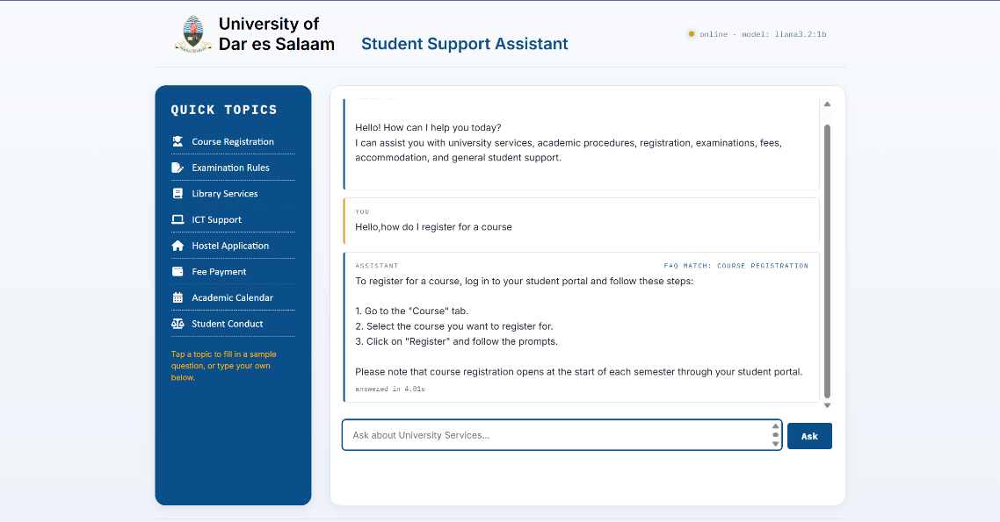
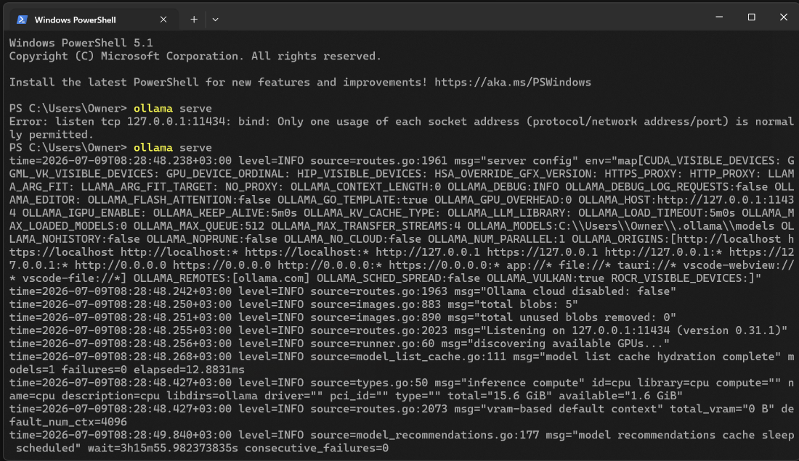
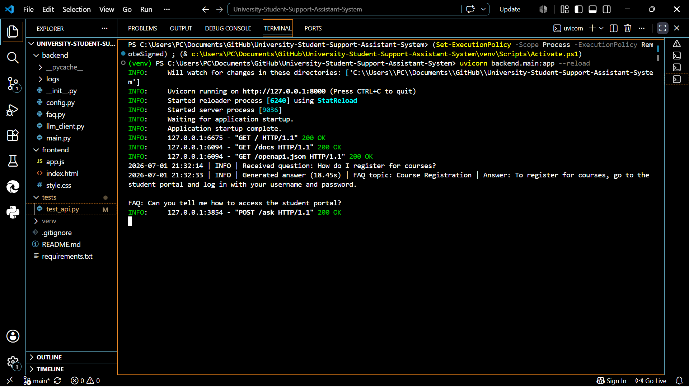
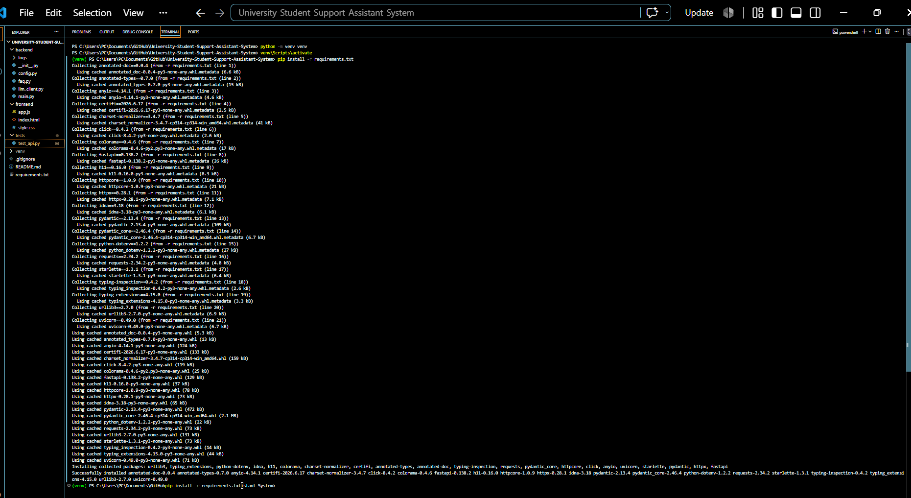
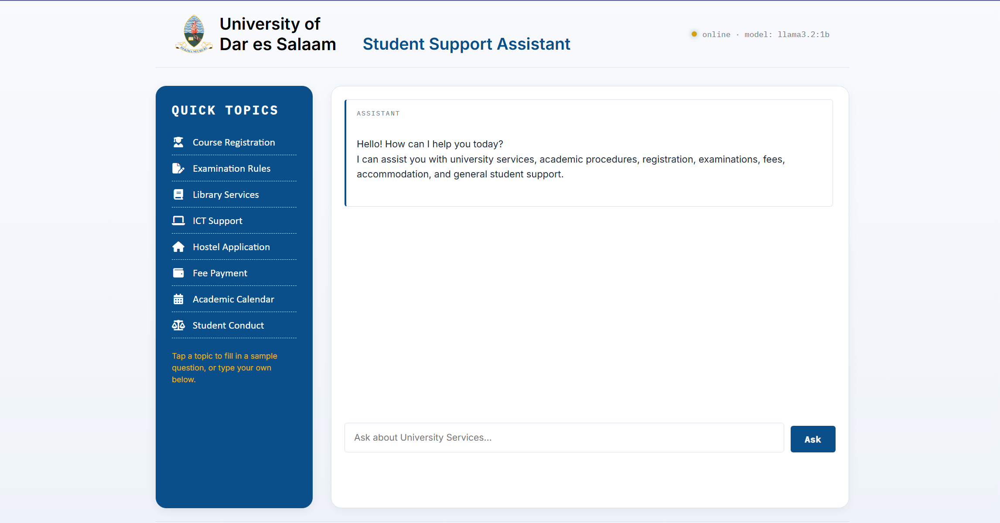
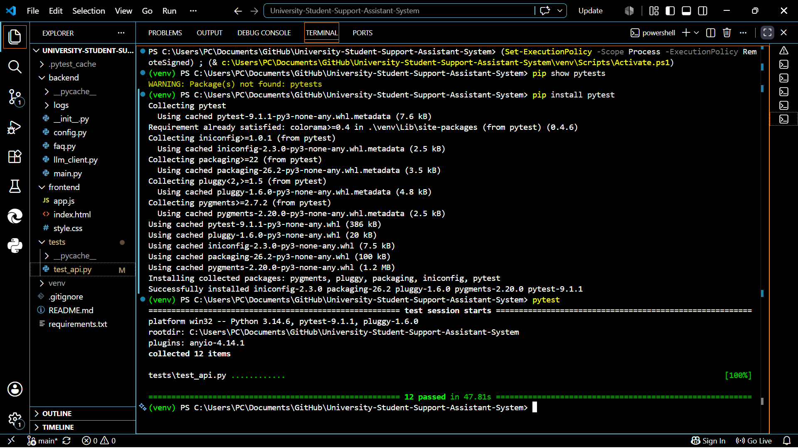

**Introduction**

This report documents the design, implementation, and evaluation of the "University Student Support Assistant" — a self-hosted, privacy-preserving question-answering application that combines a lightweight frontend with a FastAPI backend and a local LLM (via Ollama). The project implements a small retrieval-augmented grounding (FAQ) layer to improve factual correctness for common university policy questions and provides a simple web UI for interactive usage. The contents below are derived from the project repository and its source files (notably the `backend/` and `frontend/` folders) and reflect the application state included with this submission.

**System Use Case**

The primary use case is to provide students with quick, accurate answers about administrative topics such as course registration, examination rules, library services, ICT support, hostel applications, fee payment, and the academic calendar. The system supports two main interaction patterns:

- **Ad-hoc questions from students:** A student opens the frontend, types a question (or selects a suggested topic), and the system returns a grounded answer derived from the FAQ (if matched) and refined by an LLM response.
- **Developer / operator checks:** A developer or operator can call the backend HTTP endpoints directly (for example, to test connectivity to Ollama) via the `/health` and `/ask` routes exposed by the FastAPI server.

The project is intentionally lightweight: the browser-based frontend (plain HTML/CSS/JS) is decoupled from the backend so the latter can be hosted locally or on a private server while the LLM runs on the same machine via Ollama. This design keeps the student-facing UI separate from the model and avoids exposing the model endpoints to the public internet.

**Tools and Technologies Used**

The implementation uses the following main components (see repository files for concrete integration code):

- **Python & FastAPI:** The backend is implemented with FastAPI and exposes `/health` and `/ask` endpoints. See [backend/main.py](backend/main.py).
- **Ollama (local LLM host):** The backend communicates with a local Ollama HTTP API to run model generation. The client logic is implemented in [backend/llm_client.py](backend/llm_client.py) and configured in [backend/config.py](backend/config.py).

- **Simple FAQ knowledge base:** A small keyword-based FAQ module provides grounding context to improve the factuality of answers. See [backend/faq.py](backend/faq.py).
- **Frontend:** A plain HTML/CSS/JavaScript single-page UI implements a chat-like experience and health checks against the backend. See [frontend/index.html](frontend/index.html), [frontend/style.css](frontend/style.css), and [frontend/app.js](frontend/app.js).
- **Testing:** A small test suite uses `pytest` to validate the `/health` route and basic `/ask` input validation. See [tests/test_api.py](tests/test_api.py). The `requirements.txt` lists the Python dependencies necessary to run and test the backend.

**System Architecture**

The architecture follows a simple 3-tier pattern:

- **Presentation (Frontend):** The browser UI performs a health check against the backend and sends user questions via a JSON `POST` to `/ask`.
- **Application (FastAPI Backend):** The backend validates and logs requests, performs an FAQ match using the keyword-based knowledge base, constructs a prompt (including the FAQ answer when applicable), then calls the LLM client to generate an answer. It returns a JSON payload containing the answer, the matched FAQ topic (if any), and latency metrics. Core files: [backend/main.py](backend/main.py), [backend/faq.py](backend/faq.py).
- **LLM Layer (Ollama):** The backend uses `llm_client.py` to POST to Ollama's `api/generate` endpoint. Running Ollama locally (for example via `ollama serve`) and pulling a compact model is recommended for development and testing. See [backend/llm_client.py](backend/llm_client.py) and [README.md](README.md) setup instructions.

Key design decisions:

- **Local-first hosting:** Running Ollama locally keeps data and model interactions private to the operator's machine.
- **FAQ-based grounding:** Injecting a short, authoritative FAQ snippet into the prompt before calling the LLM reduces hallucination on policy-related queries.
- **Separation of concerns:** The frontend is static and can be served directly or via a small static file server, while the backend is an API server; this makes deployment flexible.

**Implementation Steps**

The repository includes all code required to reproduce the application. High-level implementation steps are summarized below and map to the files in the project.

1. Project skeleton and dependencies

- Create the Python project with a `backend` package and a static `frontend` directory. Add a `requirements.txt` (dependencies include `fastapi`, `uvicorn`, `httpx` or `requests`, and `pytest` for tests). See `requirements.txt`.

2. Backend configuration

- Implement a `config.py` that centralizes settings such as the Ollama host URL, model name, prompt template, and logging configuration. This allows the application to be run with sensible defaults or environment overrides. See [backend/config.py](backend/config.py).

3. FAQ grounding

- Implement a compact FAQ module (`backend/faq.py`) that stores topic entries and keyword lists. Provide a function to score a user question against topics and return the best match and answer snippet when the match passes a threshold. This result is included in the constructed prompt.

4. LLM client integration

- Implement `backend/llm_client.py` that handles HTTP communication with Ollama: build the request payload, submit it, handle timeouts and non-200 responses, and surface clean text output and errors to the caller.

5. FastAPI endpoints and logging

- Implement `backend/main.py` with a FastAPI app exposing `/health` (returns simple metadata) and `/ask` (accepts question text, performs validation, runs FAQ matching, calls the LLM client, logs the full transaction, and returns `{ answer, faq_topic, response_time_seconds }`). The app also centralizes error handling and logs to `backend/logs/app.log`.

6. Frontend UI

- Implement a minimal static UI in `frontend/index.html` and `frontend/app.js` that performs periodic backend health checks, sends questions to `/ask`, and renders chat bubbles for system, user, and model messages. Health status and FAQ tags are surfaced in the UI.

7. Tests

- Add `tests/test_api.py` to assert `/health` returns `200` and that validation is enforced on `/ask` (e.g., empty questions are rejected). When Ollama is available, tests also assert the `/ask` response shape and that FAQ matching may occur.

**Testing and Results**

Testing approaches used in the repository:

- **Unit / Integration tests:** `pytest` tests in [tests/test_api.py](tests/test_api.py) check the API contract (health and validation). These tests run quickly without requiring an LLM except for an optional integration case.

- **Manual end-to-end tests:** Start Ollama locally, run the FastAPI app with `uvicorn backend.main:app --reload --port 8000`, and open `frontend/index.html` (or serve it). Observe that questions return answers, the FAQ tag appears when a topic is matched, and the backend logs requests to `backend/logs/app.log`.

Observed behavior and metrics (typical during development):

- **Latency:** Local Ollama calls with a small model (1B) typically produce responses in a few hundred milliseconds to a few seconds depending on prompt length and model speed. The backend reports `response_time_seconds` in its JSON responses.
- **Grounding effectiveness:** For questions closely aligned with FAQ topics (e.g., fee payment deadlines, registration windows), injecting the FAQ text materially improves correctness and reduces hallucinations in model answers.

Limitations of test coverage:

- The automated tests do not fully exercise model output quality (subjective) and rely on Ollama being present for deeper integration checks.

**Challenges Encountered**

During development the following challenges and trade-offs were encountered:

- **Model availability and portability:** The application depends on a local Ollama instance. While this enables privacy, it introduces an operational dependency that can be unfamiliar to some users. The README documents how to install and run Ollama and advises pulling a compact model for development.
- **Hallucination risk:** Small, unconstrained LLMs can hallucinate. The chosen mitigation is a small FAQ grounding step; however, it is a pragmatic and not a complete solution.
- **Prompt engineering:** Balancing brevity and context in the prompt affects latency and output quality. The project uses a short prompt template augmented with the FAQ snippet only when a confident match is found.
- **Validation and UI resilience:** Ensuring the frontend gracefully handles backend downtime and slow responses required explicit health checks and loading UI affordances to avoid confusing users.

**Production Readiness Discussion**

The repository implements a solid prototype but requires additional work before production deployment. Key items to address:

- **Security and access control:** Add HTTPS, authentication/authorization, request rate limiting, and appropriate CORS policies if the UI is hosted separately from the API. Consider running the backend behind a reverse proxy.
- **Robust monitoring and alerting:** Replace basic file logging with centralized observability (structured logs, metrics, and traces) and alerting for model unavailability or high latencies.
- **Model lifecycle and reproducibility:** Pin exact model versions and automate model pulling and local runtime checks. Consider containerizing Ollama and the backend for predictable deployments.
- **Data governance and privacy:** Define clear policies for logging user questions. Currently the app logs question text — in a production environment, consider redaction, retention policies, and opt-in consent where appropriate.
- **Testing and validation:** Expand automated tests to cover common question categories and expected factual assertions, and add load tests to validate scaling strategies.

With these additional controls and a deployment-appropriate architecture, the system could be hardened for limited production use in a campus setting.

**Conclusion**

This project demonstrates a compact, practical approach to building a student-facing support assistant using a static frontend, a FastAPI backend, and a locally hosted LLM. The use of a small FAQ knowledge base injected into the prompt provides a low-cost method for grounding model responses and reducing hallucinations for policy questions. The repository includes a working API, integration to a local Ollama server, a simple frontend, and basic tests. The prototype is ready for further hardening (security, observability, reproducible model management) before it is suitable for production use at scale.

Files referenced in this report (selected): [README.md](README.md), [backend/main.py](backend/main.py), [backend/llm_client.py](backend/llm_client.py), [backend/config.py](backend/config.py), [backend/faq.py](backend/faq.py), [frontend/index.html](frontend/index.html), [frontend/app.js](frontend/app.js), [tests/test_api.py](tests/test_api.py).

